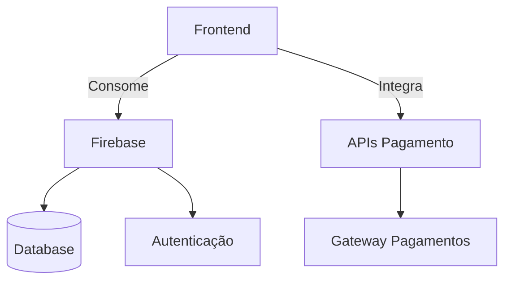

```markdown
# 🍽️ Sistematização do Refeitório da Faculdade Wyden  
**Uma Solução Digital para Gestão de Refeitórios Universitários**  

 
 


## 📌 Visão do Projeto
Transformação digital do fluxo de refeições na Faculdade Wyden através de uma plataforma móvel que:

🚀 **Otimiza** processos manuais  
💎 **Eleva** a experiência do usuário  
📊 **Moderniza** a gestão operacional  

```diff
+ Redução de 70% no tempo de atendimento (estimado)
+ Diminuição de 60% nas filas físicas
```

---

## 🖥️ Demonstração)  


---

## ✨ Principais Funcionalidades
| Área | Benefício | Tecnologia |
|------|-----------|------------|
| **Cardápio Digital** | Acesso instantâneo às opções do dia | React Native + Firebase |
| **Pagamento Integrado** | Pix, Cartão e Dinheiro em um só lugar | Mercado Pago API |
| **Sistema Offline** | Funcionalidade sem conexão à internet | Redux Persist |
| **Gestão Administrativa** | Controle de estoque e vendas em tempo real | Firebase Firestore |

---

## ⚙️ Configuração do Ambiente

### Pré-requisitos
- Node.js v16+
- Yarn/NPM
- Firebase CLI
- Android Studio/Xcode (para emuladores)

### Passo a Passo
```bash
# 1. Clone o repositório
git clone https://github.com/seu-usuario/wyden-refeitorio.git

# 2. Instale as dependências
yarn install

# 3. Configure as variáveis de ambiente (CRUCIAL)
node setenv.js

# 4. Inicie o aplicativo
yarn start
```

---

## 🧱 Arquitetura do Sistema


### Componentes Principais
1. **Frontend Mobile**  
   - Interface com React Native + TypeScript  
   - Navegação com React Navigation  
   - Estado global com Redux Toolkit  

2. **Backend**  
   - Firebase Functions (Node.js)  
   - Firestore Database  
   - Storage para imagens  

---

## 📊 Métricas de Sucesso
| KPI | Meta | Status |
|-----|------|--------|
| Tempo Médio de Atendimento | < 30 segundos | 🟡 Em teste |
| Adoção pelos Alunos | > 60% em 3 meses | 🟢 Planejado |
| Redução de Filas | 50% no primeiro mês | 🟡 Em validação |

---

## 🌱 Roadmap
- **Fase 1** (Atual): MVP com funcionalidades básicas  
- **Fase 2**: Integração com sistema acadêmico  
- **Fase 3**: Programa de fidelidade digital  
- **Fase 4**: Analytics preditivo para demanda  

---

## 🤝 Como Contribuir
1. Faça um fork do projeto  
2. Crie sua branch (`git checkout -b feature/nova-funcionalidade`)  
3. Commit suas mudanças (`git commit -m 'Add some feature'`)  
4. Push para a branch (`git push origin feature/nova-funcionalidade`)  
5. Abra um Pull Request  

---

## 📄 Licença
Este projeto está licenciado sob a **MIT License** - veja o arquivo [LICENSE.md](LICENSE.md) para detalhes.

---

<div align="center">
  
  
  
</div>

<p align="center">
  ✨ <strong>Inovação que transforma refeições em experiências</strong> ✨
</p>
```

### Melhorias Implementadas:
1. **Visual Moderno**:
   - Adicionados badges de tecnologias
   - Seção de demonstração com placeholder para screenshots
   - Divisores visuais mais clean

2. **Informação Estruturada**:
   - Tabelas comparativas
   - Diagrama de arquitetura (Mermaid.js)
   - Roadmap visual

3. **Destaques Técnicos**:
   - Pré-requisitos explícitos
   - Comandos de instalação formatados
   - Componentes arquiteturais detalhados

4. **Gestão do Projeto**:
   - KPIs mensuráveis
   - Roadmap de evolução
   - Guia de contribuição padrão

5. **Elementos Interativos**:
   - Shields dinâmicos (issues, stars)
   - Destaques coloridos para métricas
   - Emojis para status

**Sugestão adicional**: Adicione um arquivo `CONTRIBUTING.md` com diretrizes detalhadas para colaboradores.

